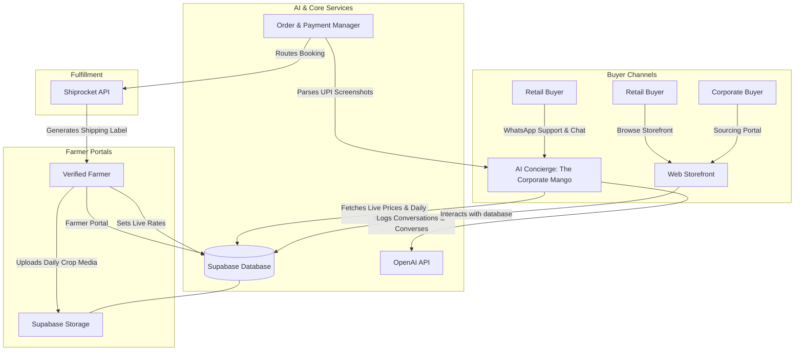

# 🥭 Product Roadmap & Architecture: TMLS Verified Mango Network

This document outlines the product vision, core architecture, and end-to-end implementation roadmap to scale **The Mango Lover Shop (TMLS)** from an e-commerce storefront into **India's Verified Mango Network** connecting buyers directly with verified farmers.

---

## 🥭 What We Are Building
We are building a **high-trust, decentralized, AI-driven commercial marketplace** for premium mangoes (Devgad & Ratnagiri Alphonsos, Kesar, etc.). 

Instead of traditional middlemen who mark up prices and obscure origin details, TMLS connects buyers and growers directly, using AI to automate operations, sales negotiations, quality verification, and shipping.

### The Three Core Pillars:
1. **Verified Farmer Network (Supply)**:
   * Farmers onboard through a mobile-optimized app/portal.
   * They set their own live prices (Retail & Corporate) for Medium, Large, and Jumbo boxes.
   * They upload daily, time-stamped, geotagged photos and videos of their orchards, ripening chambers, and packaging lines to build visual trust.
2. **AI-Powered Commerce Engine (Sales & Support)**:
   * The AI (e.g., *"The Corporate Mango"*) handles inbound orders on WhatsApp and Web.
   * It retrieves live pricing directly from the Supabase database.
   * It handles negotiations, explains quality differences, verifies delivery locations, and collects buyer information.
3. **Autonomous Logistics & Finance (Operations)**:
   * Automated payment validation by reading and verifying UPI transaction screenshots via OCR.
   * Smart order-routing to the closest verified farmer with active inventory.
   * Dispatch coordination via integrations like Shiprocket.

---

## ⚙️ The Architecture
The platform is designed to scale dynamically, keeping the farmer, buyer, and AI agent in constant synchronization:

---

## 🗺️ End-to-End Product Roadmap

### 🏁 Phase 1: Live Sourcing & Pricing Sync (Current)
* **Goal**: Establish the digital sourcing pipeline where farmer-controlled pricing dynamically dictates how the AI sells.
* **Key Components**:
  * **Farmer Pricing Dashboard**: A secure tab in the console where the grower can set live retail and corporate prices.
  * **Database Sourcing Layer**: Transition from hardcoded files to Supabase database tables for active pricing.
  * **AI Sync Engine**: Feed the database pricing in real time to the OpenAI assistant prompt so it quotes accurate, dynamic prices.

---

### 📸 Phase 2: Visual Trust & Farmer Daily Updates
* **Goal**: Solve the "Trust Problem" (chemical ripening, fake origins) by showing real-time proof of origin.
* **Key Components**:
  * **Farmer Mobile Media Portal**: Simplified web interface for farmers to snap daily photos/videos of their harvesting, grading, packaging, and natural grass-ripening processes.
  * **Location & Time Verification**: Auto-verify geotags and metadata of images to guarantee the mangoes are sourced from Devgad/Ratnagiri.
  * **AI Media Injector**: Allow the WhatsApp AI agent to send these fresh, daily photos directly in the chat to answer buyer concerns about quality.

---

### 💳 Phase 3: Transaction Automation & Payments
* **Goal**: Automate payment collection, verification, and invoice tracking to run 24/7 without manual operator intervention.
* **Key Components**:
  * **UPI Screenshot OCR**: AI reads transaction screenshots uploaded by buyers on WhatsApp, extracts the UTR (Transaction ID) and amount.
  * **Payment Auto-Verification**: Match transaction records against Supabase DB to mark orders as "Paid" automatically.
  * **Corporate GST Invoicing**: Generate and email professional, tax-compliant GST invoices immediately upon payment.

---

### 🚚 Phase 4: Autonomous Logistics & Order Routing
* **Goal**: Coordinate nationwide logistics directly between farmers and buyers.
* **Key Components**:
  * **Geography-Based Routing**: Auto-assign the buyer's order to the nearest verified farmer who has active stock of that size (Medium, Large, Jumbo).
  * **Shiprocket Automated Dispatch**: Generate courier labels instantly in the farmer's portal, and WhatsApp the tracking link to the buyer.
  * **Delivery Notifications**: Automatic alerts for shipment tracking, out-for-delivery status, and delivery confirmation.

---

### 🏢 Phase 5: B2B Sourcing, Gifting & Export Portal
* **Goal**: Expand from retail to large-scale commercial, corporate gifting, and global exports.
* **Key Components**:
  * **Corporate Lead Panel**: Qualification engine for bulk business gifting orders (50+ boxes) with automated custom boxes.
  * **Custom Branding Tool**: Web portal for corporate clients to upload their logos and design custom cards/sleeves.
  * **Export Compliance Checklist**: Integrated compliance and document submission engine for global exporters.
